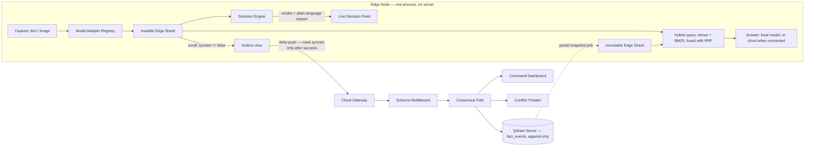

# Aegis Edge

**An offline-first edge memory kernel that decides what's worth remembering, what's worth trusting, and what's worth sending to the cloud — demoed under disaster response, built to drop into any vertical unchanged.**

Problem Statement 03 (Qdrant): AI-Powered Edge Memory & Intelligence Platform

> [!NOTE]
> Built on **Qdrant Edge**, which is **in beta** — announced as a private beta on 29 July 2025 and still in beta today, per Qdrant's own documentation. We pin the exact version and never float it. If you are comparing this to prior art, start with [Qdrant Edge](https://qdrant.tech/documentation/edge/) and its [sync guide](https://qdrant.tech/documentation/edge/edge-synchronization-guide/) rather than taking our description of it on faith.

This is the entry point. `AGENTS.md` (problem definition + verified engine facts + build order) is what a coding agent should read first; `backend.md` and `frontend.md` are the build specs.

---

## 1. The problem, in one paragraph

Edge devices — kiosks, wearables, field tablets, robots — need instant local answers with no network, but they also keep learning new things locally that a shared cloud picture needs to know about. The naive version of this, sync everything with last-write-wins, breaks in real ways: it floods bad connections, it corrupts shared knowledge when two devices disagree, it lets deleted facts ghost back into existence, and it treats a dozen devices reporting on the same real-world event no differently than two.

## 2. What we are building

A generic **Edge Memory Kernel** with four parts, each mapped to a claim we can defend if a judge pushes on it:

| Module | Claim |
|---|---|
| Decision Engine | Every captured fact is scored — novelty, urgency, sensitivity, completeness — before it is kept, queued, or dropped, and the reason is human-readable, not a black box. |
| Model Adapter Registry | The kernel is model-agnostic and modality-agnostic via a config file. Same kernel, different vertical, zero code changes. |
| Sync Protocol | Delta-only push, partial-snapshot pull, and a two-shard query path, so devices both publish and learn. |
| Trust/Consensus Resolver | **The novel piece.** N-way, trust-weighted consensus over an append-only event log, with a visible confidence score and an explicit `DISPUTED` state when the system genuinely isn't sure. |

Two design decisions carry most of the weight:

- **The outbox is not a store.** It is a filtered `scroll` over the device's own mutable shard, so no fact is ever held in two places. Marking a point synced only *after* a successful push is what makes a crash mid-push harmless.
- **Cloud memory is event-sourced.** Facts are immutable; a retraction is another event, not a delete. That is *why* a retracted fact cannot come back, rather than a promise that it won't.

> [!IMPORTANT]
> **Hybrid search means dense + sparse, fused.** It does not mean "vector search plus payload filters" — that is filtered search, and the two are different products. Qdrant Edge ships BM25 built in but does **not** fuse at query time, so we run the dense and sparse legs separately and fuse them with Reciprocal Rank Fusion. We report recall@5 for both.

## 3. Prior art, and the gap we actually occupy

We did not want to reinvent something that already ships, so we read the source rather than the marketing:

- **Qdrant Edge** — real, and the substrate we build on. An in-process embedded vector engine, Python and Rust bindings only, no background services, ~11 MB footprint. Its sync is a *pattern you assemble* from shard helpers plus your own transport, not a `.sync()` call.
- **[`qdrant/qdrant-edge-demo`](https://github.com/qdrant/qdrant-edge-demo)** — real, public, and linked from the official sync guide. Qdrant's own smart-glasses demo: mutable + immutable shards, a persistent queue, partial-snapshot sync, CLIP embeddings. **This is the closest prior art to our sync layer and we cite it deliberately.** Our difference is everything above the transport: the decision layer, and multi-device reconciliation.
- **[`qdrant-labs/edge-mission-control`](https://github.com/qdrant-labs/edge-mission-control)** — real, with a live demo. A home robot building searchable object memory: dense + BM25 RRF hybrid queries in one Edge shard, a cross-modal embedder so text queries return images, live facet counts, sub-millisecond latency on screen. **This is the closest prior art to our retrieval layer.**
- **[Qdrant's "Memory at the Edge" post](https://qdrant.tech/blog/qdrant-edge-on-device-vector-search/)** (June 2026) — the vendor already owns the "local first, cloud when needed, sync between" narrative.
- **[HyperspaceDB](https://github.com/YARlabs/hyperspace-db)** — real. Hyperbolic vector DB with a Merkle-tree delta-sync protocol for edge-to-cloud, WASM clients, 1-bit quantization. Solves efficient sync; does not do semantic conflict resolution.
- **[Pocket RAG](https://arxiv.org/abs/2602.13229)** (arXiv 2602.13229) and **[EdgeRAG](https://arxiv.org/abs/2412.21023)** (arXiv 2412.21023) — real, published work on single-device offline RAG under tight memory budgets. Pocket RAG is also our reference for the on-device answer path.
- **QdrantSync** — a small CLI for migrating collections between two Qdrant servers. Plumbing, not an intelligence layer.

**The gap, stated honestly:** the two official Qdrant demos are single-device systems that sync to a hub. HyperspaceDB syncs efficiently but does not reason about what two devices are claiming. The arXiv work is single-device. **Nobody we found handles a fleet of devices simultaneously learning and having to trust or dispute each other's updates** — and that is the layer we build.

An earlier draft of this file cited two projects as verified prior art that we could not find traces of. They are removed rather than softened. If we cannot verify it, we do not cite it.

## 4. Architecture



No SQL in the runtime path, and none needed: the Decision Engine, the outbox, the memory browser, the facet counts, and the consensus fold all read and write Qdrant. Pick the store by operation — Qdrant when the question is *"what is semantically near this?"*, and because the consensus layer appends immutable events rather than overwriting state, it needs no transactions.

Full detail: `backend.md` (kernel, decision rules, resolver, API contract) and `frontend.md` (screens, design direction, data contract).

## 5. The five moments the demo has to land

1. Multiple devices, fully offline, answering instantly.
2. A live decision feed narrating *why* — kept, queued, synced, rejected — in plain language.
3. Two devices disagreeing offline, converging into one trusted answer with a visible confidence score on reconnect.
4. A safety-critical fact jumping the sync queue ahead of routine ones on a degraded link.
5. Real latency and memory numbers from a real constrained target, on screen, measured.

If a feature doesn't serve one of these five, it doesn't ship before the deadline.

## 6. Design direction

Tactical ops console, not "AI product." Near-black base, monospace for all data, IDs, timestamps and scores, one alert-red and one green/amber accent, sharp corners, hairline borders, no gradients, no glass cards, no chat-bubble UI. Rationale in `frontend.md` §2.

## 7. Tech stack

- **Device:** Python 3.11+ + FastAPI, one process per node, [`qdrant-edge-py`](https://pypi.org/project/qdrant-edge-py/) with two `EdgeShard`s per device (mutable for local writes, immutable for the server snapshot). Dense embeddings from `fastembed`; BM25 from Edge's own built-in embedder. **No SQL on device.**
- **Hub:** one Qdrant Server collection, `fact_events`, append-only, plus a FastAPI gateway running the schema middleware and consensus fold.
- **Frontend:** React + Vite + TypeScript + Tailwind, no component library. A thin renderer over the backend contract — no model or policy logic in the browser.
- **Models:** swappable via config, never hardcoded. One cross-modal embedder, so a text query can retrieve an image.
- **Constrained target:** Raspberry Pi 4/5, or a 512 MB / 1-CPU container as an honest fallback.

## 8. Build order

1. Edge shard + capture + instant query, offline. No sync yet.
2. Decision Engine — every verdict plus a reason string a non-expert can read.
3. Hybrid search: BM25 leg + RRF fusion, with a measured dense-vs-hybrid recall@5.
4. Outbox + push handshake — cut the network, capture, reconnect, cloud updates itself.
5. Pull direction: the immutable shard from a partial snapshot, so a device learns a fact it never captured.
6. Consensus fold + retractions, with a conflict injector so the disagreement is reproducible on demand.
7. Trust decay made visible, plus the resolver-vs-last-write-wins benchmark.
8. The answer layer: same question, two paths, UI shows which served it.
9. Frontend, screen by screen per `frontend.md` — Conflict Theater last, and don't rush it.
10. Rehearse the five moments, in order, on a timer.

## 9. Known gaps and demo-scale limits

We'd rather say these out loud than have a judge find them:

- **The answer layer needs a bigger target than the 512 MB container.** A small local model answering offline needs a Pi-class or ≥4 GB host. Either commit to that as the constrained target or run generation on a subset of nodes and say which.
- **The consensus fold is a `scroll` per `corroboration_key` per sync cycle.** Correct and fast to low thousands of events; not a design that scales past that. The hub also grows monotonically, by design, because deletions are events.
- **The immutable shard is a full local copy of the hub collection, on every device.** Hub size × device count is the RAM budget, and nothing warns you when you cross it.
- **Embedding drift** if edge and cloud ever run different-sized models. Fine while they share a model family; a real gap the moment they don't.
- **No schema-version backfill for old app versions.** Plumbing, not a demo beat — stretch goal.
- **No short-lived working-memory tier** distinct from the consolidated event log.

## 10. Repository layout

```
/edge-node/       FastAPI service, Decision Engine, Model Adapter Registry, two shards
/cloud-gateway/   schema middleware, consensus fold
/frontend/        React app per frontend.md
/config/          per-vertical YAML (disaster-response.yaml, retail.yaml, ...)
AGENTS.md         problem definition, verified engine facts, build order — read first
backend.md        engineering spec
frontend.md       UI spec
README.md         this file
```
