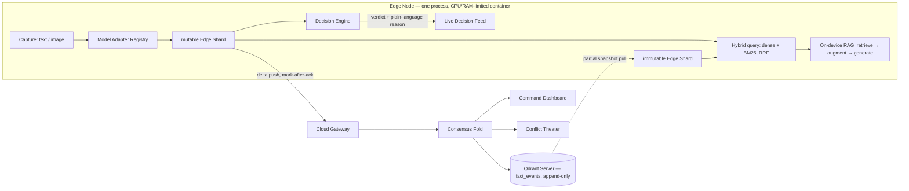

<div align="center">

# Ex-Vero

**An offline-first edge memory kernel on Qdrant Edge — each device is a smart notepad that searches and answers offline, and a walkie-talkie that disputes and converges with the fleet when it reconnects.**

Built for Qdrant · Problem Statement 03 — AI-Powered Edge Memory & Intelligence Platform


[Quick start](#quick-start) • [Overview](#overview) • [How it works](#how-it-works) • [The five demo moments](#the-five-demo-moments) • [Architecture](#architecture) • [Tech stack](#tech-stack) • [Docs](#docs)

</div>

---

## Quick start

Everything runs in Docker: the Qdrant hub, the cloud gateway, Ollama, and a
**real 1-CPU / 512 MB constrained edge node**.

**Prerequisites:** Docker with Compose, Python 3.11+, Node 18+.

**1 — start the stack**

```bash
cd edge-node
docker compose -f docker/docker-compose.yml up --build
```

**2 — start the dashboard** (separate terminal)

```bash
cd edge-node/frontend
npm install        # once
npm run dev
```

Open **http://localhost:5173**. It talks to the edge node on `:8000` by default;
override with `VITE_API_BASE_URL` if you need to.

**3 — first run only:** pull the answer model. Without it, answers fall back to
extractive mode (correct, but less impressive).

```bash
docker compose -f docker/docker-compose.yml exec ollama pull qwen2.5:1.5b
```

### Where things are

| Service | URL | What it is |
| --- | --- | --- |
| Dashboard | http://localhost:5173 | React UI |
| Edge node | http://localhost:8000/docs | FastAPI, interactive route docs |
| Cloud gateway | http://localhost:8088 | Sync + consensus fold |
| Qdrant | http://localhost:6333/dashboard | Hub — inspect the `facts` collection |
| Ollama | http://localhost:11434 | Local answer model |

### Captured facts reach Qdrant only after a push

This is the offline-first design, not a bug. A capture is stored **on the
device**; nothing leaves until you push it, and the hub never receives data it
wasn't handed.

```bash
curl -sX POST localhost:8000/devices/dev-01/push
```

Then refresh the Qdrant dashboard and the point appears in `facts` (and in
`fact_events`, the append-only log). Device ids are `dev-01`…`dev-04` and
`cam-01`…`cam-03`.

### Prove the constraint is real

```bash
docker inspect docker-edge-tiny-1 --format 'NanoCPus={{.HostConfig.NanoCpus}} Memory={{.HostConfig.Memory}}'
# NanoCPus=1000000000 Memory=536870912   ← 1 CPU, 512 MB

curl -s localhost:8000/devices/dev-01/telemetry
# {"target_label": "emulated constrained target (1.0 CPU / 512 MB container)", ...}
```

### Tests

```bash
cd edge-node
.venv/bin/python -m pytest -q

# the container acceptance test needs a Docker daemon
docker info >/dev/null && .venv/bin/python -m pytest tests/test_telemetry_container.py -q
```

### Stop

```bash
docker compose -f docker/docker-compose.yml down          # keep data
docker compose -f docker/docker-compose.yml down -v       # wipe volumes
```

### Troubleshooting

| Symptom | Cause | Fix |
| --- | --- | --- |
| Dashboard loads but shows no data | Browser blocked cross-origin calls to `:8000` | Hard-refresh (`Ctrl+Shift+R`) |
| Qdrant dashboard empty | Nothing pushed yet | `POST /devices/{id}/push` |
| Answers slow or timing out | Ollama model not pulled | `exec ollama pull qwen2.5:1.5b` |
| Gateway restarts in a loop | Qdrant not ready | It retries 5×; if it still fails it stops loudly rather than silently using memory |

---

## Overview

Edge devices — kiosks, wearables, field tablets, robots — need instant local answers with
no network, but they also keep learning things locally that a shared cloud picture needs
to know about. The naive version, *sync everything with last-write-wins*, breaks in real
ways: it floods bad connections, it corrupts shared knowledge when two devices disagree,
it lets deleted facts ghost back into existence, and it treats a dozen devices reporting
the same event no differently than two.

**Ex-Vero is the intelligence layer above the vector store that fixes those four
things** — built entirely on Qdrant. Qdrant Edge is the on-device engine, Qdrant Server
is the cloud hub, and Qdrant is the only datastore anywhere. No SQL, no second store.

> [!NOTE]
> The disaster-response fleet (paramedic tablets, triage kiosks) is **configuration, not
> code**. Swap `config/disaster-response.yaml` for another vertical and the same kernel
> runs unchanged — that is the claim this repo is built to defend.

> [!IMPORTANT]
> **Qdrant Edge is in beta**, per Qdrant's live documentation. `qdrant-edge-py` is pinned
> to `0.8.0` and never floated. The beta status is re-checked against the live docs before
> any presentation.

## What it does

| Module | What it owns |
| --- | --- |
| **Decision Engine** | Scores every captured fact — novelty, urgency, sensitivity, completeness — before it is kept, queued, or dropped, and emits a reason a non-expert can read. |
| **Model Adapter Registry** | Model- and modality-agnostic through a config file: text embedding, cross-modal CLIP, BM25, and the answer model all swap by one YAML edit. Zero training, pretrained checkpoints only. |
| **Sync Protocol** | Delta-only push and partial-snapshot pull against a real Qdrant Server, with a two-shard query path so devices both publish *and* learn. |
| **Trust / Consensus Resolver** | N-way, trust-weighted consensus over an append-only event log, with a visible confidence score and an explicit `DISPUTED` state. The novel piece. |
| **Answer layer (on-device RAG)** | Retrieve from Qdrant Edge, generate a grounded, sourced answer — a small local model offline, a cloud model online, one interface. |

## How it works

Two ideas carry most of the weight:

- **The notepad.** Each device stores text and image facts in a local Qdrant Edge shard,
  answers hybrid (dense + BM25, fused with RRF) queries offline in milliseconds, and
  generates a grounded answer with on-device RAG — all with no network.
- **The walkie-talkie.** Devices can't hear each other while offline; each just remembers
  what it saw. On reconnect they push to a real Qdrant Server and the gateway folds every
  report into one trusted picture. Three devices agreeing raises confidence; a device
  that keeps being wrong loses trust; genuine disagreement is surfaced as `DISPUTED`, not
  silently resolved; and a retraction can never ghost back.

> [!NOTE]
> **Everything measured is real; only the hardware and the network are emulated.** Each
> device runs in a real CPU/RAM-limited container, telemetry is read from the real cgroup,
> and the network layer injects real latency, a real byte cap, and real failures. Numbers
> on screen are measured, never typed in.

## The five demo moments

1. Multiple devices, fully offline, answering instantly.
2. A live decision feed narrating *why* — kept / queued / synced / rejected — in plain language.
3. Two devices disagreeing offline, converging on reconnect into one trusted answer with a visible confidence score.
4. A safety-critical fact jumping the sync queue ahead of routine ones on a degraded link.
5. Real latency and memory numbers from the emulated constrained target, on screen, measured.

## Architecture



The network layer sits on the sync transport only — never on the query or answer path
(enforced by a test), which is what makes "instant offline search" an architectural
guarantee rather than lucky timing.

## Tech stack

- **Device:** Python 3.11+ + FastAPI, one process per node, [`qdrant-edge-py`](https://pypi.org/project/qdrant-edge-py/) with a mutable + immutable `EdgeShard`. Dense text embeddings from [`fastembed`](https://github.com/qdrant/fastembed) (`BAAI/bge-small-en-v1.5`); cross-modal images via CLIP (`Qdrant/clip-ViT-B-32`); BM25 built into Qdrant Edge.
- **Answer model:** [Ollama](https://ollama.com) running `qwen2.5:1.5b` offline; a cloud model online; both behind one `Generator` interface with an extractive fallback for tiny devices.
- **Hub:** a real Qdrant Server (`qdrant/qdrant` via Docker) collection `fact_events`, append-only, plus a FastAPI gateway running the schema middleware and consensus fold.
- **Frontend:** React + Vite + TypeScript + Tailwind, no component library — a thin renderer over the backend contract.
- **Constrained target:** a real 1-CPU / 512 MB container today (swappable for a Raspberry Pi later with zero code change).

## Docs

| Document | Purpose |
| --- | --- |
| [`docs/00-problem-statement.md`](docs/00-problem-statement.md) | The sponsor brief — what we are building and why, with the acceptance bar per goal. |
| [`docs/10-prd.md`](docs/10-prd.md) | Product & software requirements: FR/NFR, personas, acceptance criteria, traceability. |
| [`docs/20-architecture.md`](docs/20-architecture.md) | System view: context, single-node, sync loop, and consensus-fold diagrams. |
| [`docs/backend.md`](docs/backend.md) | Engineering spec: physical model, model registry, decision engine, real-server sync, consensus, answer layer, build phases. |
| [`docs/frontend.md`](docs/frontend.md) | UI spec: screens, design direction, data contract. |
| [`docs/API.md`](docs/API.md) | REST/WebSocket route contract for the frontend team. |
| [`docs/AGENTS.md`](docs/AGENTS.md) | Build guide: verified Qdrant Edge facts, silent traps, correctness invariants, build order. |

## Project status

All ten backend build phases in `edge-node/` are complete and audited — capture,
hybrid search, decision engine, outbox/push, snapshot pull, consensus fold,
semantic conflict detection, network layer, on-device RAG, measured benchmarks,
and telemetry from real cgroup stats. The React dashboard is built and wired to
the live backend contract.

Verified in a real `--cpus=1 --memory=512m` container: `cpu_pct` reads 0.19% idle
and 100.2% under load, RSS ~296 MB, and the target label reports the container's
actual limits rather than a typed-in figure. Benchmarks score real code against
labeled fixtures — no figure is stored, and the recall and resolver margins are
deliberately narrower than the original hardcoded claims, with per-shape results
returned so a reader can see where each number comes from.
