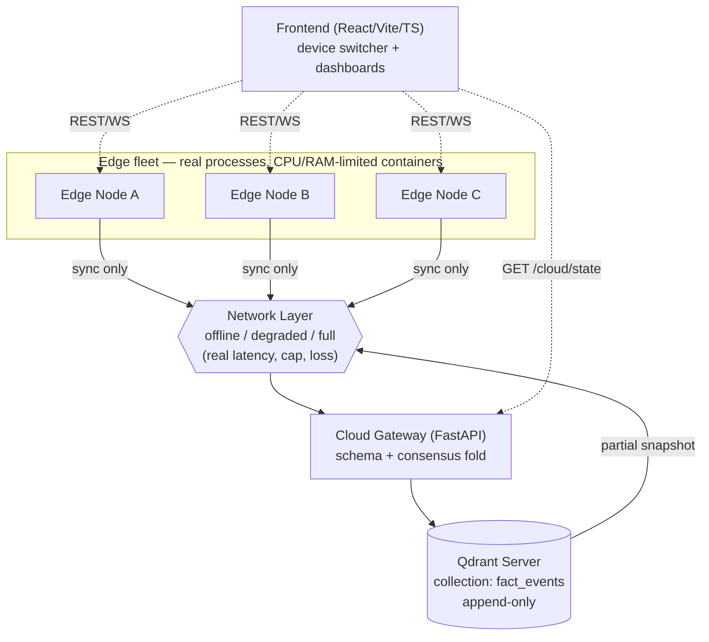
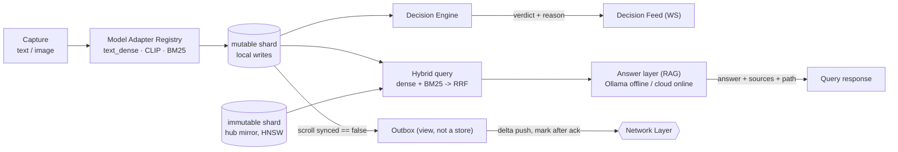
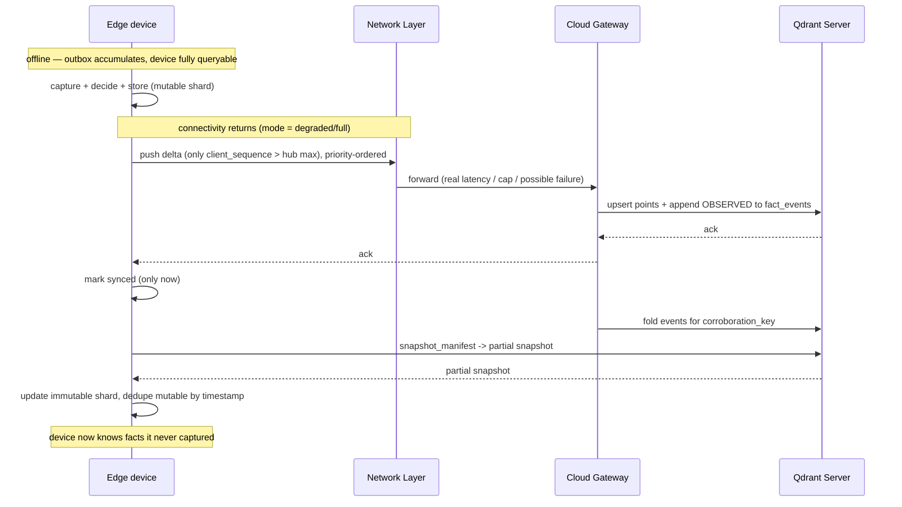
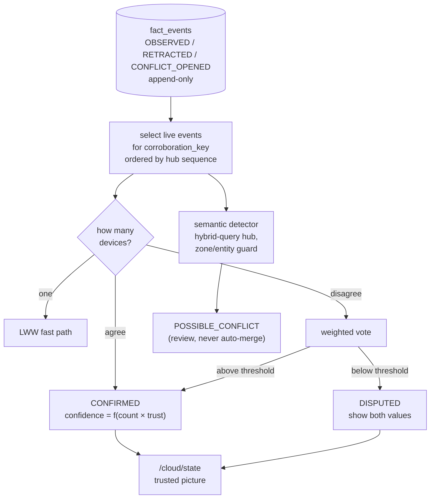

# Aegis Edge — Architecture

**Role of this document:** the system view. It shows the processes, the data flow, the
Qdrant Edge shard model, the sync loop, and the consensus fold in one place, so anyone
can see how the parts fit before reading `backend.md` for detail.

**Principle:** Qdrant is the only datastore — Qdrant Edge on device, Qdrant Server in the
cloud. No SQL, no second store. Real code; only the hardware and network are emulated,
with measured effects.

---

## 1. System context

The query and answer paths never touch the Network Layer — that isolation is the proof
that offline search is instant.

---

## 2. Inside one edge node

Two shards; queries read both and dedupe by point ID. The outbox is a filtered scroll
over the mutable shard, not a second queue.

---

## 3. Sync loop (edge ↔ real Qdrant Server)

Mark-after-ack is what makes a crash mid-push harmless: the point stays pending and on
the device, and upsert is idempotent on re-push.

---

## 4. Consensus fold (the trust layer)

Trust is derived from the log (agreement rate, recency-decayed), never stored beside it,
so it can't drift out of sync with history. Retraction is an append, so it can't ghost.

---

## 5. Physical emulation map

| Physical thing | Emulated by | Measured as |
|---|---|---|
| Device compute/RAM | Docker container with `--cpus` / `--memory` limits | real cgroup CPU %, RSS MB |
| Slow/lossy link | Network Layer token bucket + latency + failure injection | real bytes-over-wire, retries, duration |
| Going offline / reconnect | global `POST /network/mode` flip | outbox depth, drain events |
| Clock drift | per-device skew knob (metadata only) | fold result unchanged (test) |

Everything above is real code with real measurement; only the *device* and the *link
conditions* are stand-ins for physical hardware we don't have yet.
